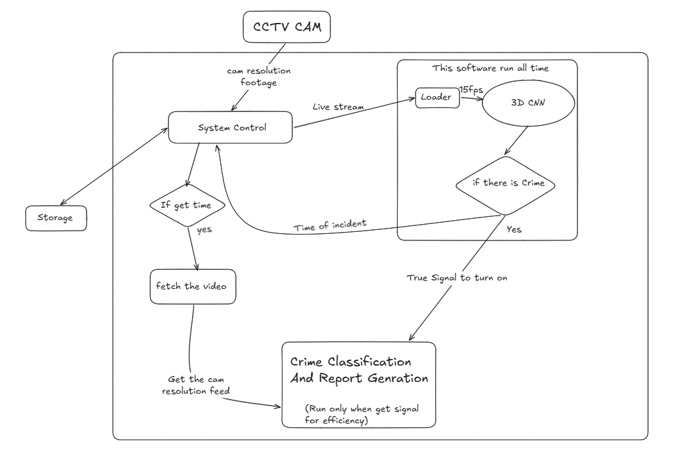

# Intelligent Real-Time Crime Detection System Using CCTV Footage

[](https://www.python.org/)
[](https://pytorch.org/)
[](https://opencv.org/)
[](https://developer.nvidia.com/cuda-zone)
[]()

---

## Executive Summary

Modern surveillance networks generate petabytes of CCTV video feeds daily. Despite ubiquitous deployment, traditional surveillance operations still rely overwhelmingly on **manual human monitoring**. This model suffers from severe operator fatigue, slow response latency, missed anomalies, and the permanent loss of critical early evidence.

This project delivers an **Intelligent Real-Time Crime Detection System** that transforms passive CCTV camera feeds into an autonomous, proactive surveillance and forensic pipeline. By employing a **two-tier triggered architecture**, the system continuously monitors streams for criminal activity with minimal compute overhead and, upon detection, dispatches high-resolution video streams to specialized deep learning models that answer the core forensic questions: **What happened? How was it done? Who did it?**

---

## Problem Statement

Conventional CCTV infrastructures face critical operational bottlenecks:
- **Human Supervision Bottleneck:** Human monitors lose focus after only 20 minutes of continuous surveillance.
- **Detection Latency:** Incidents are typically investigated *post-facto* rather than intercepted in real-time.
- **Compute Scalability:** Running heavy multi-class action classifiers, object detectors, and face matchers 24/7 across hundreds of native-resolution 4K/1080p camera feeds is computationally prohibitive.
- **Lack of Actionable Evidence Synthesis:** Raw video footage requires labor-intensive manual review to extract suspect faces, weapon types, and event timestamps for police reporting.

---

## Proposed Solution: Two-Tier Triggered Architecture

To solve the dual challenge of **real-time scalability** and **deep forensic precision**, the system operates in two strategic tiers:

1. **Tier 1 — Continuous Surveillance (24/7 Monitoring)**:
   - Runs a lightweight, highly optimized **3D Residual CNN with Squeeze-and-Excitation Attention (`CNN3D_ResSE`)** on downsampled, 15 FPS video streams.
   - Evaluates frame-differencing motion vectors ($\Delta = |F_t - F_{t-1}|$) to reliably separate normal human activity from violent/criminal activity.
   - Emits an instant trigger signal $(t_{\text{incident}})$ when the crime confidence score exceeds $\ge 0.5$.

2. **Tier 2 — Triggered On-Demand Forensic Dispatch**:
   - Activated **only** upon an incident trigger from Tier 1, retrieving the native-resolution video segment from the storage buffer.
   - Concurrently invokes three specialized forensic models:
     -  **What Happened?** ➔ **SlowFast Network**: Multi-class crime action classification (e.g., Fighting, Assault, Robbery, Arson, Vandalism).
     -  **How Was It Done?** ➔ **YOLOv5 / YOLOv8**: Weapon and threat object detection (handguns, knives, bats, masks).
     -  **Who Did It?** ➔ **RetinaFace + ArcFace**: Face detection, facial landmark alignment, 512-D embedding extraction, and cosine similarity matching against a database of known offenders.

3. **Automated Incident Dossier & Police Alert**:
   - Aggregates findings into a standardized **JSON Dossier** and a printable **PDF Incident Report** containing timestamp, GPS location, camera ID, weapon crops, suspect face matches, and video clips.
   - Dispatches instant alerts via API/webhook to law enforcement and nearest police stations.

4. **Future Add-on (Phase 5)**:
   - Modern **Web UI Dashboard** for live surveillance streams, push notifications, and interactive forensic dossier review.

---

##  System Architecture

### Architectural Pipeline Flowchart

```
┌────────────────────────────────────────────────────────────────────────┐
│                        CCTV Camera Feed                                │
└───────────────────────────────────┬────────────────────────────────────┘
                                    │
         ┌──────────────────────────┴──────────────────────────┐
         │ (15 FPS, Downscaled)                                │ (Native Resolution Buffer)
         ▼                                                     ▼
┌──────────────────────────────────────┐            ┌────────────────────┐
│ Phase 1: 3D-CNN Binary Detector      │            │   System Storage   │
│ (24/7 Continuous Crime vs No-Crime)  │            │    Video Buffer    │
└──────────────────┬───────────────────┘            └─────────┬──────────┘
                   │                                          │
       Crime Detected? (Score >= 0.5)                         │
                   │ Yes                                      │
                   ├────────────────────────────┐             │
                   ▼ (Timestamp + Signal)       │             │ Fetch Incident
         ┌───────────────────┐                  │             │ Video Window
         │   System Control  │ ─────────────────┼─────────────┘
         └─────────┬─────────┘                  │
                   │                            ▼
                   │              ┌──────────────────────────────────────┐
                   │              │ Full Resolution Incident Video Clip  │
                   │              └──────────────────┬───────────────────┘
                   │                                 │
                   │            ┌────────────────────┼───────────────────┐
                   │            ▼                    ▼                   ▼
                   │   ┌─────────────────┐  ┌─────────────────┐ ┌─────────────────┐
                   │   │ Phase 2         │  │ Phase 3         │ │ Phase 4         │
                   │   │ SlowFast Net    │  │ YOLOv5          │ │ RetinaFace +    │
                   │   │ (Action Class)  │  │ (Weapons/Obj)   │ │ ArcFace         │
                   │   │                 │  │                 │ │ (Face ID)       │
                   │   │ "WHAT"          │  │ "HOW"           │ │ "WHO"           │
                   │   └────────┬────────┘  └────────┬────────┘ └────────┬────────┘
                   │            │                    │                   │
                   └────────────┼────────────────────┴───────────────────┘
                                ▼
         ┌──────────────────────────────────────────────────────────────┐
         │  Incident Aggregator & Automated Report Generator            │
         │  - Incident ID & Exact Timestamp                             │
         │  - Crime Classification & Confidence                         │
         │  - Weapon Detection Bounding Boxes                           │
         │  - Suspect Face Thumbnails & Database Matches                │
         │  - Automated Police Station Dispatch Alert                   │
         └──────────────────────────────┬───────────────────────────────┘
                                        │
                                        ▼
         ┌──────────────────────────────────────────────────────────────┐
         │ Phase 5 (Future Add-on): Web UI Monitoring Dashboard         │
         │ (Live Stream, Push Notifications, Interactive Dossier Viewer)│
         └──────────────────────────────────────────────────────────────┘
```

### Visual Architecture Diagram



---

##  Summary Phase Matrix

| Phase | Core Technology | Primary Function | Trigger Mechanism | Output / Evidence | Status |
| :--- | :--- | :--- | :--- | :--- | :--- |
| **Phase 1** | **3D-CNN (`CNN3D_ResSE`)** | Binary Crime vs. No-Crime Detection | Continuous (24/7, 15 FPS) | Binary probability score & trigger timestamp | **Implemented** |
| **Phase 2** | **SlowFast Network** | Multi-class crime classification (*What*) | Triggered by Phase 1 | Crime category (e.g., Fighting, Arson, Assault) | **Roadmap** |
| **Phase 3** | **YOLOv5 / YOLOv8** | Weapon and object detection (*How*) | Triggered by Phase 1 | Bounding boxes & annotated weapon keyframes | **Roadmap** |
| **Phase 4** | **RetinaFace + ArcFace** | Face detection & identity matching (*Who*) | Triggered by Phase 1 | Aligned facial crops & suspect database matches | **Roadmap** |
| **Integration** | **Incident Orchestrator** | Synthesis & emergency dispatch | On completion of Phases 2–4 | Automated PDF / JSON Incident Dossier & Alert | **Roadmap** |
| **Phase 5** | **FastAPI / Modern Web UI** | Surveillance cockpit & incident hub | Standalone platform | Live streams, alert drawers, & interactive report viewer | **Future Add-on** |

---

##  Detailed Phase Breakdown

### Phase 1: 3D-CNN Binary Detector (Active)
- **Model**: `CNN3D_ResSE` (~2.6M parameters), implemented in `Model.py`.
- **Input Pipeline**: 
  - Sliding clip window: 24 frames resized to $128 \times 128 \times 3$.
  - Explicit **Motion Computation (Frame Differencing)**: Absolute pixel difference between consecutive frames ($\Delta = |F_t - F_{t-1}|$) highlighting motion dynamics and suppressing static background clutter.
- **Architecture**:
  - Entry 3D Conv stem with MaxPool3D.
  - 4 Residual Blocks with 3D Convolutions (`3×3×3`).
  - Squeeze-and-Excitation (SE) channel attention modules for adaptive temporal feature re-weighting.
  - AdaptiveAvgPool3D + Fully Connected classification head with Dropout (0.4 / 0.3) and BatchNorm1D.
- **Inference & Testing**:
  - Continuous sliding window inference script implemented in `test_Model.py`.
  - Automated video dataset integrity and FFmpeg corruption checker in `video_check.py`.

### Phase 2: SlowFast Network (Action Classification)
- **Objective**: Classify the specific nature of the crime (*What happened?*).
- **Architecture**: Dual-pathway SlowFast model:
  - **Slow Pathway**: Low frame rate, high spatial capacity to capture static environment and contextual scene semantics.
  - **Fast Pathway**: High frame rate ($\alpha$ times higher temporal resolution), low channel capacity to capture rapid kinematic movements (punches, kicks, weapon swings).
- **Target Categories**: Fighting, Assault, Armed Robbery, Burglary, Arson, Explosion, Vandalism, and False-Positive Rejection.

### Phase 3: YOLOv5 (Weapon & Object Detection)
- **Objective**: Pinpoint weapons and threatening items (*How was it committed?*).
- **Target Classes**: Handguns, rifles, knives, machetes, baseball bats, crowbars, and masks.
- **Deliverables**: Coordinate bounding boxes, risk classification (High/Medium/Suspicious), and high-resolution annotated keyframes.

### Phase 4: RetinaFace + ArcFace (Facial Recognition & Identification)
- **Objective**: Identify suspects against known offender databases (*Who was involved?*).
- **RetinaFace**: Robust single-stage facial detector with 5-point facial landmark regression (eyes, nose, mouth corners) resilient to CCTV lighting and extreme angles.
- **ArcFace**: Generates a 512-dimensional normalized face embedding; computes cosine similarity against a suspect gallery:
  $$\text{Cosine Similarity} = \frac{\mathbf{u} \cdot \mathbf{v}}{\|\mathbf{u}\| \|\mathbf{v}\|}$$
- **Threshold Matching**: Matches $\ge 0.65$ trigger known-suspect alerts; unmatched faces are preserved as high-resolution forensic crops for investigative records.

### Phase 5: Web UI & Monitoring Dashboard (Future Add-on)
- **Backend**: Python (FastAPI / Flask) with asynchronous WebSocket live streams and SQLite/PostgreSQL incident logs.
- **Frontend Cockpit**: Multi-camera grid, real-time audio/visual alert drawer, interactive incident scrubber, suspect profile manager, and 1-click PDF dossier export.

---

##  Incident Dispatch Schema (Police API Contract)

When an incident triggers Tier 2 analysis, an automated intelligence dossier is synthesized:

```json
{
  "incident_id": "INC-20260923-0842",
  "timestamp": "2026-09-23T14:32:18Z",
  "camera_metadata": {
    "camera_id": "CAM_SECTOR_07_NORTH",
    "location": "Sector 7 Main Gate Walkway",
    "coordinates": {"lat": 12.9716, "lng": 77.5946}
  },
  "tier1_alert": {
    "crime_detected": true,
    "confidence_score": 0.942
  },
  "tier2_forensics": {
    "action_classification": {
      "primary_label": "Armed Assault",
      "confidence": 0.887,
      "top_predictions": ["Armed Assault (0.887)", "Robbery (0.091)", "Fighting (0.022)"]
    },
    "weapon_detection": [
      {
        "class": "Knife",
        "confidence": 0.89,
        "bbox": [412, 230, 478, 310],
        "threat_level": "High Threat"
      }
    ],
    "facial_recognition": [
      {
        "suspect_id": "SUSPECT-DB-0421",
        "matched": true,
        "name": "Identified Offender",
        "similarity_score": 0.814,
        "face_crop_url": "evidence/INC-20260923-0842/face_01.jpg"
      }
    ]
  },
  "dispatch_status": {
    "alert_sent_to": "HQ Central Dispatch / Station 4",
    "pdf_dossier_url": "reports/INC-20260923-0842_Dossier.pdf",
    "evidence_video_clip": "clips/INC-20260923-0842_raw.mp4"
  }
}
```

---

##  Technologies & Dependencies

| Domain | Tools & Libraries |
| :--- | :--- |
| **Language** | Python 3.10+ |
| **Deep Learning** | PyTorch (`torch>=2.0`), torchvision |
| **Computer Vision** | OpenCV (`opencv-python>=4.8`) |
| **Model Architectures** | 3D Res-SE CNN, SlowFast, YOLOv5/v8, RetinaFace, ArcFace |
| **Numerical & ML Utilities** | NumPy (`>=1.23,<2.0`), scikit-learn (`>=1.2`), tqdm |
| **Video Diagnostics** | FFmpeg |
| **Hardware Acceleration** | NVIDIA CUDA, TensorRT / TF32, MIG (Multi-Instance GPU) |

---

##  Project Structure

```bash
CrimeDetectionCCTV/
├── Dataset/                     # Video dataset directory
│   ├── Violence/                # Positive crime/violence video samples
│   └── NonViolence/             # Negative normal activity video samples
├── Doc/                         # Project architecture & documentation
│   ├── PROJECT_PLAN.md          # Comprehensive phased roadmap & specifications
│   ├── Architecture.jpeg        # Visual system architecture diagram
│   ├── Crime_Detection.pdf      # Reference research & presentation slides
│   └── Crime_Detection.xlsx     # Dataset metadata & metrics tracking
├── models1/                     # Saved model checkpoints (created during training)
│   └── best_3dcnn_crime_detector.pth
├── Architecture.jpeg            # Root architecture schematic
├── Model.py                     # Phase 1: 3D Res-SE CNN architecture, training & validation pipeline
├── test_Model.py                # Phase 1: Video inference script & anomaly detection evaluator
├── video_check.py               # Dataset validator & corruption detector using FFmpeg
├── requirements.txt             # Project Python dependencies
└── README.md                    # Project documentation & system overview
```

---

##  Getting Started

### 1. Prerequisites
- **Operating System:** Linux (Ubuntu 20.04+ recommended) or Windows 10/11
- **Python:** Version 3.10 or higher
- **GPU:** NVIDIA GPU with CUDA support (or multi-core CPU with OpenMP)
- **FFmpeg:** Installed and accessible via system `PATH` (used by `video_check.py`)

### 2. Environment Setup

```bash
# Clone the repository
git clone https://github.com/soumallyasarkar/CrimeDetectionCCTV.git
cd CrimeDetectionCCTV

# Create and activate virtual environment
python3 -m venv .venv
source .venv/bin/activate    # On Windows: .venv\Scripts\activate

# Install required dependencies
pip install -r requirements.txt
```

### 3. Validate Dataset Integrity

Before training, verify that all video files in `Dataset/Violence` and `Dataset/NonViolence` are free of corruption and readable by OpenCV and FFmpeg:

```bash
python video_check.py
```

### 4. Train the Phase 1 3D-CNN Model

Train the `CNN3D_ResSE` binary detector with stratified dataset splitting, motion differencing, and early stopping:

```bash
python Model.py
```
- Best weights will be saved automatically to `models1/best_3dcnn_crime_detector.pth`.

### 5. Run Video Inference

Evaluate a video file using the trained model to detect crime sequences:

```bash
python test_Model.py
```

---

##  Roadmap & Milestones

- [x] **Phase 1: 3D-CNN Binary Architecture** (`CNN3D_ResSE` with SE Motion Attention)
- [x] **Phase 1: Dataset Verification & Preprocessing Pipeline** (`video_check.py`, `Model.py`)
- [x] **Phase 1: Inference Runner** (`test_Model.py`)
- [ ] **Phase 1: Full Dataset Benchmark & ROC-AUC / F1-Score Optimization**
- [ ] **Phase 2: SlowFast Multi-Class Action Classifier Integration**
- [ ] **Phase 3: YOLO Weapon & Threat Object Detection Integration**
- [ ] **Phase 4: RetinaFace + ArcFace Suspect Recognition & Facial Dossier Extraction**
- [ ] **Orchestration: Automated Incident Report & Police Alert Dispatch Engine**
- [ ] **Phase 5: Web UI Monitoring Cockpit & Alert Reviewer Dashboard**

---

##  License & Acknowledgements

This project is developed for intelligent real-time surveillance and public safety enhancement. Dataset sources include standard violence detection benchmarks and CCTV surveillance archives.
